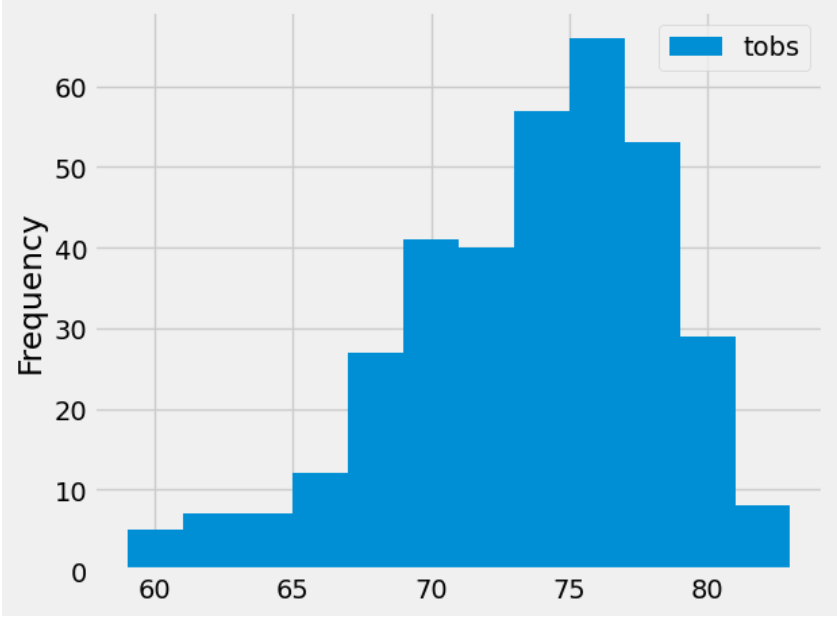

# sqlalchemy-challenge
## Background
Congratulations! You've decided to treat yourself to a long holiday vacation in Honolulu, Hawaii. To help with your trip planning, you decide to do a climate analysis about the area. The following sections outline the steps that you need to take to accomplish this task.

## Objectives
This Challenge is divided into two parts:

    1. Analyze and Explore the Climate Data
    2. Design Your Climate App

## Analyze and Explore the Climate Data
In this section, I started by finding the most recent date in the dataset and using that date, got the previous 12 months of precipitation data by querying the previous 12 months of data. After loading the results into a Pandas DataFrame, setting the columns, and sorting, I created a plot to display the data:

Finally, I used Pandas to print the summary statistics for the precipitation data:

In the next section, I completed a data analysis. I started by calculating the total number of stations in the dataset, then found the station with the greatest number of observations. Using this station, I queried the previous 12 months of TOBS data and plotted the results on a histogram. 

## Design Your Climate App
Design a Flask API based on the queries that you just developed. It includes: Homepage, Precipitation Data, Stations List, TOBS Data, and Data for a chosen date range.

